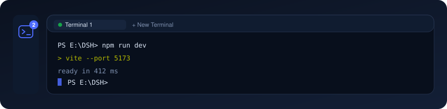

<p align="center">
  
</p>

# dsh-plugin-terminal-panel

[English](README_EN.md) | 中文

[](https://www.npmjs.com/package/dsh-terminal-panel)
[](LICENSE)
[](https://github.com/BaiZhi967/dsh-plugin-terminal-panel)

**在 DSH 网页里开终端**：侧栏点一下，主区域就多出一个和「对话」同级的终端面板，里面是**真 PTY**（node-pty / ConPTY），不是假的输出框，也不弹系统窗口。

- 终端跑在 **DSH 宿主进程**里，输出通过 SSE 实时推给页面；
- 关掉页面、刷新页面都不掉线，PTY 存活并**回放最近 256 KB 输出**，回来画面还在；
- 面板宽度变化会自动 `resize` PTY，shell 的重绘跟着走。

## ✨ 功能

| 能力 | 说明 |
|---|---|
| **侧栏入口** | 左栏面板图标区多一个终端图标，与「插件」图标同级；点它主区域切到终端面板，机制与「对话」面板完全一致 |
| **活跃计数** | 图标右上角实时显示运行中的终端数量，为 0 时自动隐藏；悬停提示同步带上数量 |
| **多标签** | 一个面板里开多个终端（上限 12 个），每个一个标签，带状态点和关闭按钮 |
| **重命名** | 双击标签名，或点标签上的 ✎；`Enter` 提交、`Esc` 取消、失焦自动提交（中文 / emoji 正常） |
| **自绘终端** | 内置一个小型 VT 引擎：ANSI 颜色（16 / 256 / 真彩）、光标定位、清行清屏、备用屏幕、滚动区域、宽字符 |
| **跟随主题** | 亮 / 暗两套 ANSI 调色板：亮色主题下 `37`／`93` 映射为深灰 / 深黄，白底上也能看清（PowerShell 的输入高亮不再"隐形"） |
| **文本选择** | 标签栏 ⧉ 一键切到「选择文本」模式（暂停键盘输入），可直接框选复制输出 |
| **中文输入** | 独立输入通道，IME 组合输入、中文、emoji 都能正确送进 PTY |
| **热重载** | 改 `impl.js` 后 `POST /__reload` 即可生效，不用重启 DSH；客户端代码改动由 DSH 的模块热更新自动送达页面 |

## 📦 安装

从 npm 安装（包名 [`dsh-terminal-panel`](https://www.npmjs.com/package/dsh-terminal-panel)）：

```sh
dsh plugin --profile web add dsh-terminal-panel
dsh --profile web
```

装好后刷新一次页面（或直接看侧栏），左栏面板图标区就会出现终端图标。

> 纯 JS 实现：无构建步骤、无运行时依赖。
> 若提示找不到包，通常是镜像尚未同步新版本 —— 可指定官方源再装一次，或稍后重试：
> `dsh plugin --profile web add dsh-terminal-panel --registry=https://registry.npmjs.org/`
> 环境要求：DSH `>= 0.1.6-alpha.2`、Node `^22.19.0 || >=24.0.0`；宿主进程需要有可用 PTY（本插件用 `subprocess.spawnTerminal`，即宿主自带的 node-pty）。

## 🚀 用法

1. 点左栏的**终端图标** → 主区域打开终端面板；
2. 点 **+ 新建终端** → 立即分配一个 PTY，shell 自动选 `pwsh` → `powershell` → 宿主默认 shell，工作目录默认取最新工作区；
3. 直接在面板里敲命令（点击面板即聚焦输入）；
4. 双击标签名改名；✎ 也是改名；✕ 关闭（进程树会被终止）；
5. 面板随窗口变化自动 `resize`。

## 🧱 结构

```
dsh-plugin-terminal-panel/
├── host.js           # 宿主入口：只承载路由 + 热重载外壳
├── impl.js           # 宿主实现：PTY 生命周期、SSE 推送、write/resize/close/rename
├── client.js         # 客户端：终端面板、侧栏图标、VT 引擎、输入处理
├── cordis.patch.yml  # bundle 补丁：向 profile 插入插件行
└── package.json      # dsh.bundle.patch + dsh.client 声明
```

两侧如何协作：

```
侧栏图标 / 终端面板 (client.js)
        │  同源 HTTP（回环地址）
        ▼
GET  /system-terminals/api/stream?id=…   ← SSE：先回放缓冲，再推实时输出
POST /system-terminals/api/{list,create,write,resize,close,rename,remove}
        ▼
impl.js ── subprocess.spawnTerminal() ──► 真 PTY（node-pty / ConPTY）
```

设计上有意分成两个文件：**加载过的 ESM 模块会在宿主进程里被永久缓存**，所以 `host.js` 保持极简、把逻辑放进 `impl.js`，由 `host.js` 用带缓存参数的动态 `import()` 拉取 —— 这样替换 `impl.js` 后一次 `POST /__reload` 就能生效，无需重启 DSH。

### 本地 API

路由前缀 `/system-terminals/api`，仅监听 DSH 自己的回环地址，无需登录态（与生态内其他插件的私有路由一致）：

| 方法 | 作用 |
|---|---|
| `GET /health` | 版本、平台、shell、PTY 可用性 |
| `GET /list` | 终端列表（id、标题、cwd、pid、行列、状态、是否可 resize） |
| `POST /create` | `{cwd?, cols?, rows?}` → 新建终端 |
| `POST /write` | `{id, data}` → 写入 PTY（原始字节，UTF-8） |
| `POST /resize` | `{id, cols, rows}` |
| `POST /close` | `{id}` → 终止进程 |
| `POST /rename` | `{id, title}` → 改名（去空白、上限 60 字） |
| `POST /remove` | `{id}` → 从列表移除已退出的终端 |
| `GET /stream?id=` | SSE：`history` / `data` / `status` / `exit` 事件，base64 负载 |
| `POST /__reload` | 开发用：重新加载 `impl.js` |

## 📄 License

[MIT](LICENSE) © 2026 BaiZhi967
